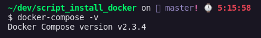

# Script to install the latest version of docker-compose

<p>
    
</p>

Download the script
```bash
curl -L https://github.com/SouzaPatrick/script_install_docker/blob/master/README.md -o docker.sh
```

Change it to be an executable file
```bash
sudo chmod +x docker.sh
```

Run the script
```bash
./docker.sh
```

